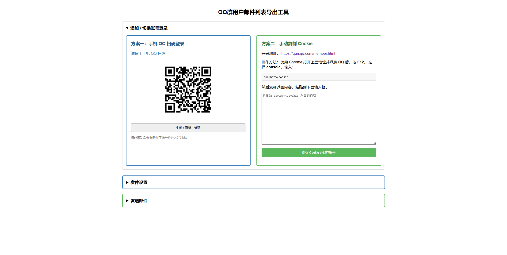
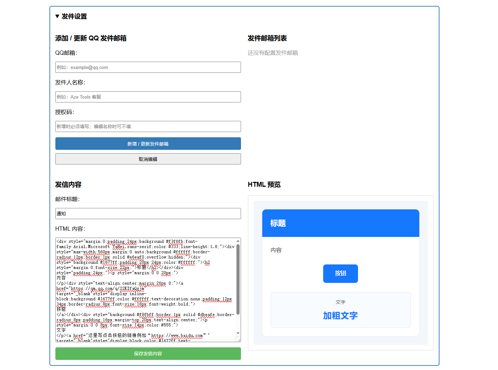
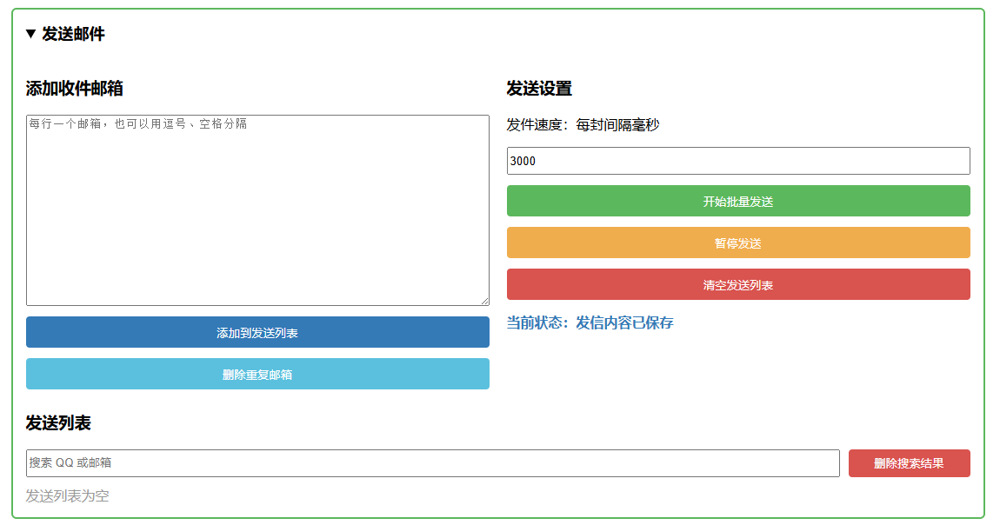
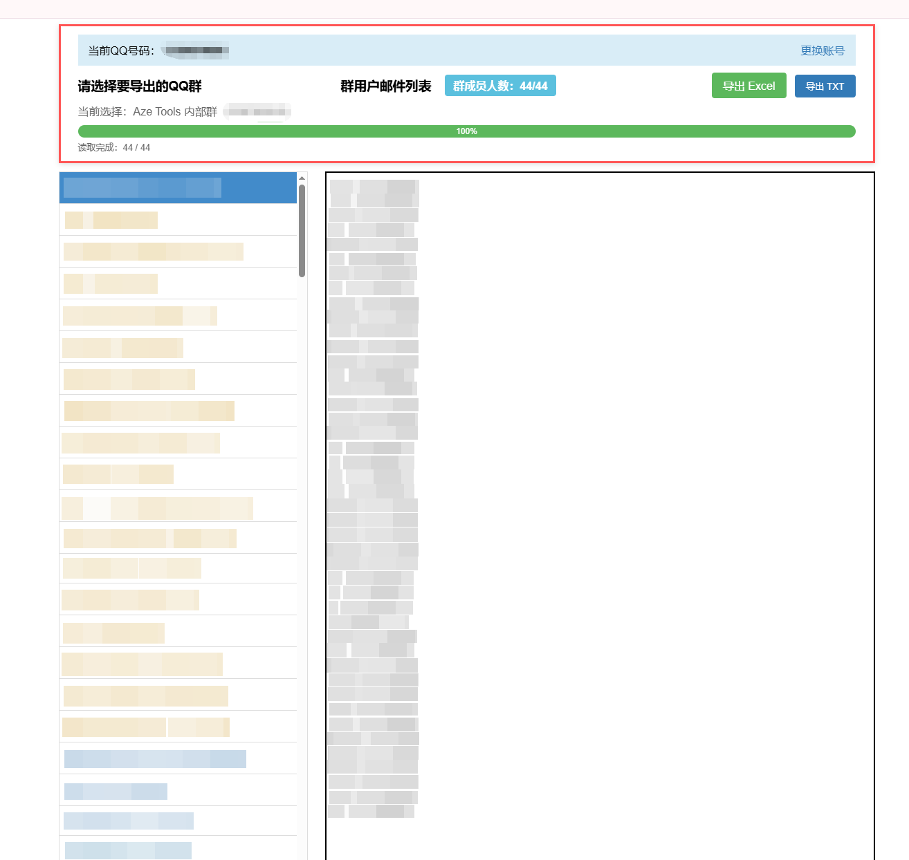

# QQ群用户邮件列表导出工具

一个基于 Node.js 的 QQ 群成员邮箱导出工具，支持 QQ 扫码登录、Cookie 登录、群成员邮箱提取、Excel/TXT 导出，以及邮件发送配置与批量发送。

> 说明：本项目仅用于个人学习、内部管理和已授权的数据处理场景。请勿用于垃圾邮件、骚扰、爬取无权限群成员或任何违法用途。

---

## 功能特性

- 支持手机 QQ 扫码登录
- 支持手动 Cookie 登录
- 支持保存多个 QQ 登录账号
- 支持读取 QQ 群列表
- 支持提取群成员 QQ 邮箱
- 支持导出 Excel
- 支持导出 TXT
- 支持读取进度显示
- 支持发件邮箱配置
- 支持多个 QQ 邮箱轮询发信
- 支持发件人名称配置
- 支持 HTML 邮件内容编辑与实时预览
- 支持发送列表管理
- 支持搜索、删除、去重收件邮箱
- 支持单独发送和批量发送
- 支持发送状态展示：待发送、发送中、已发送、失败

---

## 界面预览

### 1. 添加 / 切换账号



### 2. 发件设置



### 3. 发送邮件



### 4. 登录成功并读取群成员邮箱



---

## 运行环境

推荐环境：

```text
Windows 10 / Windows 11
Node.js 16.20.2
npm 8.x